# ISEP - MEI - ES - ARSOFT & ODSOFT

## Folder structure
- [`lms/`](https://github.com/Raccoons-Army/mei-es-arsoft-odsoft-g007/tree/main/lms) contains the Library Management REST API and all its documentation.
- [`lms/docs/`](https://github.com/Raccoons-Army/mei-es-arsoft-odsoft-g007/tree/main/lms/docs) has:
  - [`baseProject/`](https://github.com/Raccoons-Army/mei-es-arsoft-odsoft-g007/tree/main/lms/docs/baseProject) where there's all the documentation made by the students that developed the API
  - [`SystemAnalysisAndDesign/`](https://github.com/Raccoons-Army/mei-es-arsoft-odsoft-g007/tree/main/lms/docs/SystemAnalysis) where there's all the documentation made by us. Contains the Logic Views, Implementation Views, Physical Views and Process Views from the SAI (system-as-is) and STB (system-to-be)

# Index
- [SAI (system-as-is)](#sai-system-as-is)
    - [Logic View](#logic-view)
    - [Implementation View](#implementation-view)
- [STB (system-to-be)](#stb-system-to-be)
    - [Logic View](#logic-view-1)
    - [Implementation View](#implementation-view-1)
    - [Physical View](#physical-view)
    - [Recommendation feature](#recommendation-feature)
    - [OAuth IAM - Google and Facebook](#oauth-iam---google-and-facebook)
- [ASR](#asr)
- [Architectural design alternatives and rational](#architectural-design-alternatives-and-rational)

## SAI (system-as-is)
The way the system was presented to use at the begining of the project.

### Logic View

#### Logic View Level 1
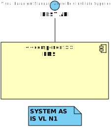

#### Logic View Level 2
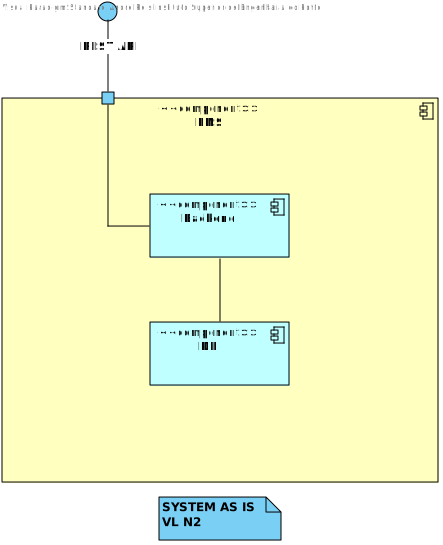

#### Logic View Level 3
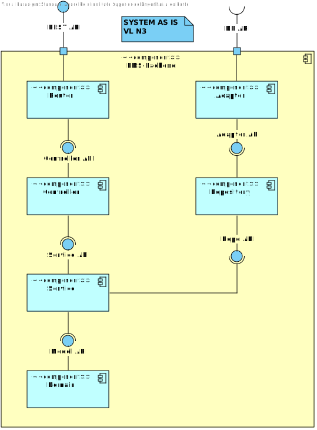

### Implementation View

#### Implementation View Level 2

#### Implementation View Level 3
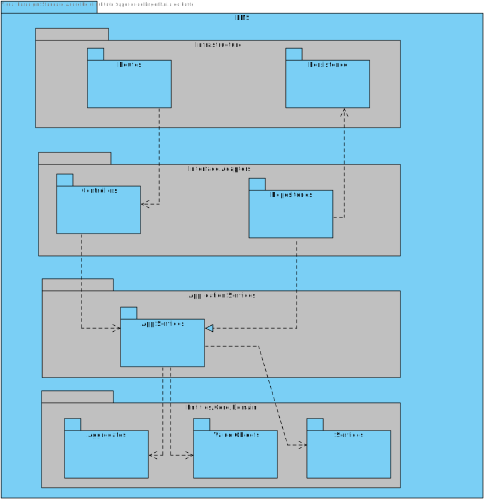

## STB (system-to-be)
The way we've change the system to the point that it is now.

### Logic View

#### Logic View Level 1
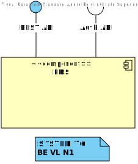

#### Logic View Level 2
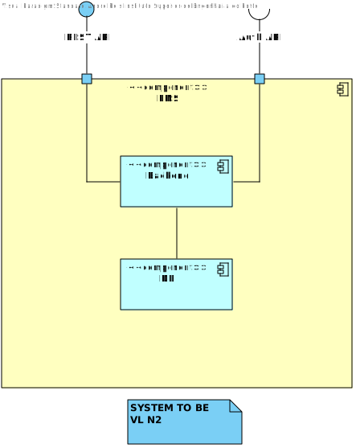

#### Logic View Level 3
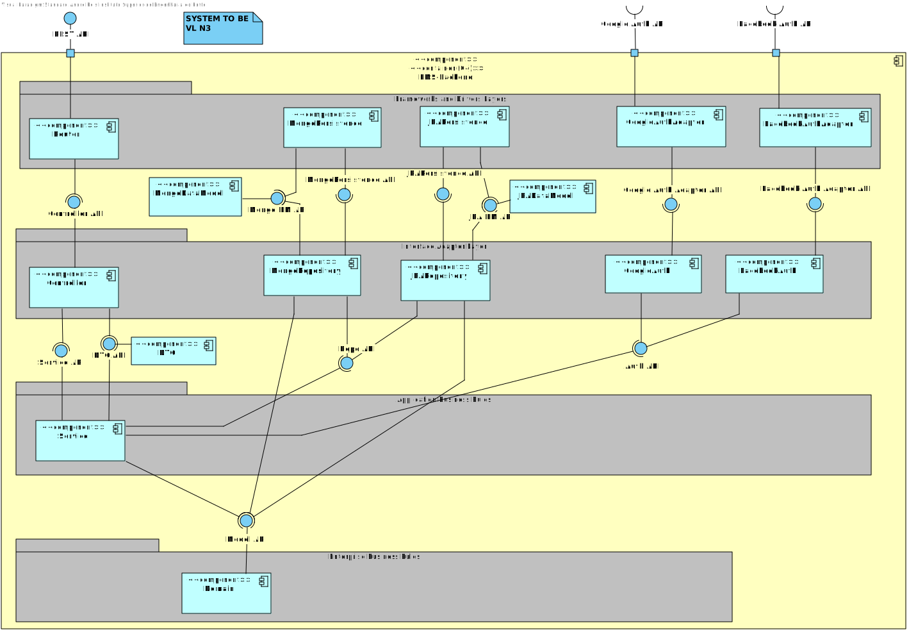

### Implementation View

#### Implementation View Level 2
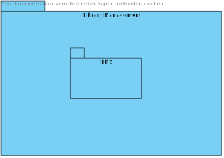

#### Implementation View Level 3
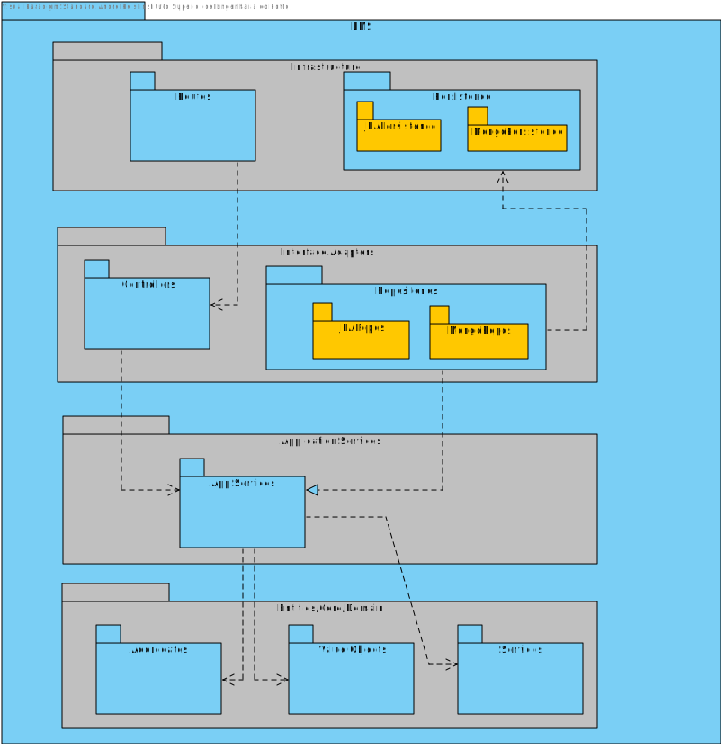

### Physical View

#### Physical View Level 2
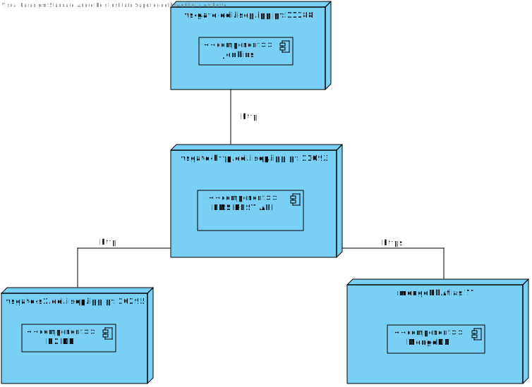

### Recommendation feature
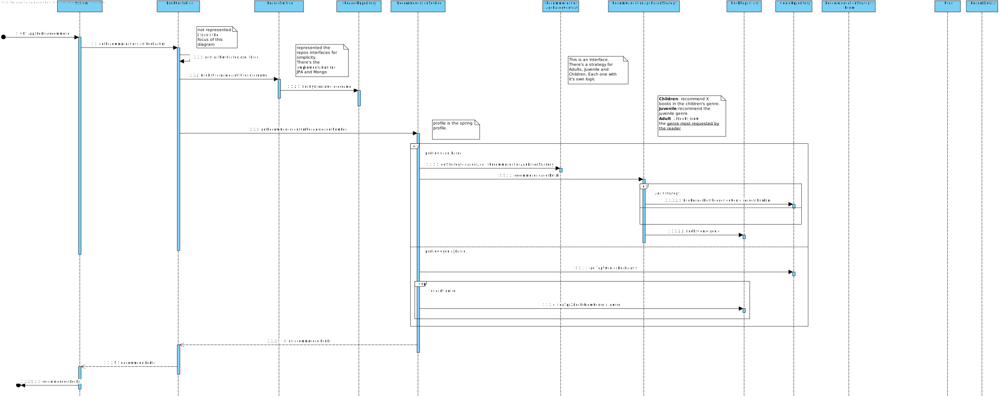

### OAuth IAM - Google and Facebook
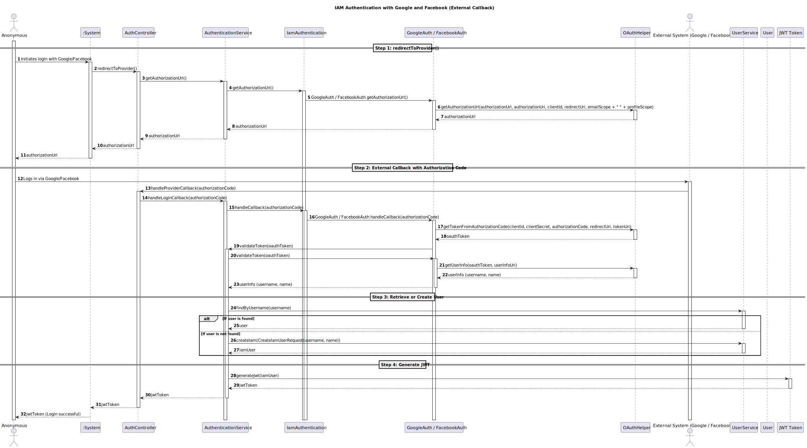

## ASR

### Persisting data in different data models (e.g. relational, document) and SGBD (e.g.MySQL, SQL Server, MongoDB, Redis)

| Quality Attribute Scenario I                                                                                                                                                                                                                                                                                                                                                                                                                                                                                                                                                 |
|------------------------------------------------------------------------------------------------------------------------------------------------------------------------------------------------------------------------------------------------------------------------------------------------------------------------------------------------------------------------------------------------------------------------------------------------------------------------------------------------------------------------------------------------------------------------------|
| **Stimulus**: The LMS System does not provide variability to persist data according to different data models and DBMS requested.   **Stimulus Source**: A new branch or repository is created every time a new customer has constraints for persistence.   **Environment**: For now, only one type of DBMS is able to be used.   **Artifact**: Persistence Layer.   **Response**: A configuration-based solution must be provided, so that only one branch/project is maintained.   **Response Measure**: The configuration must not take longer than 1 hour. |

### Adopting different IAM (Identity and Access Management) providers (e.g. Google,Facebook, Azure)

| Quality Attribute Scenario II                                                                                                                                                                                                                                                                                                                                                                                                                                                                                                                                                                                                                                                                                        |
|----------------------------------------------------------------------------------------------------------------------------------------------------------------------------------------------------------------------------------------------------------------------------------------------------------------------------------------------------------------------------------------------------------------------------------------------------------------------------------------------------------------------------------------------------------------------------------------------------------------------------------------------------------------------------------------------------------------------|
| **Stimulus**: The LMS System only integrates the built-in login system and does not support any external IAM providers, limiting user authentication options.   **Stimulus Source**: A client requests integration with a specific IAM provider not currently supported by the application.   **Environment**: The application is currently hardcoded to use the built-in login, with no flexibility for external IAM integration.   **Artifact**: User authentication module.   **Response**: A flexible architecture must be implemented that allows for runtime configuration of various IAM providers.   **Response Measure**: The application should be able to use both built-in login and IAM. |

### Generating Lending and Authors ID in different formats according to varying specifications

| Quality Attribute Scenario III                                                                                                                                                                                                                                                                                                                                                                                                                                                                                                                                                                                                                                                                                         |
|------------------------------------------------------------------------------------------------------------------------------------------------------------------------------------------------------------------------------------------------------------------------------------------------------------------------------------------------------------------------------------------------------------------------------------------------------------------------------------------------------------------------------------------------------------------------------------------------------------------------------------------------------------------------------------------------------------------------|
| **Stimulus**: The LMS System does not support generating IDs in various formats needed by different clients.   **Stimulus Source**: A new client comes on board with specific ID format requirements that differ from existing formats.   **Environment**: The system currently hardcodes the ID generation format, limiting adaptability.   **Artifact**: ID generation service.   **Response**: An extensible ID generation service must be developed, allowing formats to be configured based on client requirements.   **Response Measure**: The system should be able to generate IDs in the specified format within seconds, depending on the configuration without altering the underlying code. |

### Recommending Lendings according to varying specifications

| Quality Attribute Scenario IV                                                                                                                                                                                                                                                                                                                                                                                                                                                                                                                                                                                                                                                                                                    |
|----------------------------------------------------------------------------------------------------------------------------------------------------------------------------------------------------------------------------------------------------------------------------------------------------------------------------------------------------------------------------------------------------------------------------------------------------------------------------------------------------------------------------------------------------------------------------------------------------------------------------------------------------------------------------------------------------------------------------------|
| **Stimulus**: The LMS System has a static recommendation algorithm that does not accommodate different criteria set by clients.   **Stimulus Source**: A client requests recommendations based on unique lending criteria that differ from the default algorithm.   **Environment**: The existing recommendation system is rigid, operating under a single set of rules.   **Artifact**: Recommendation engine.   **Response**: A dynamic recommendation engine must be designed to allow for different algorithms and criteria to be injected at runtime.   **Response Measure**: The system should return relevant lending recommendations that align with client specifications in real time without downtime. |

## Architectural design alternatives and rational

### Tactics

In our project, we implemented **Modifiability** by **Reducing Coupling** between components. Below, we describe how we applied the tactics of **Encapsulation**, **Using an Intermediary**, and **Abstracting Common Services**.

#### 1. Encapsulation

#### Implementation
- **Interface Definition**: Defining an interface by encapsulating common behaviors. The interface defines common methods, but does not expose the underlying implementation details of how these operations are carried out for different implementations.
- **Implementation Classes**: Each implementation class encapsulates the specific details of operations for its respective type.
#### Example
- BookRepository interface defines common methods implemented by the JpaBookRepoImpl and MongoBookRepoImpl like save, findById, findALl, and more specific ones.
- IamAuthentication interface defines common methods implemented by the GoogleAuth and FacebookAuth.
---

#### 2. Use an Intermediary

#### Implementation
- **Service Layer as Intermediary**: The service layer acts as an intermediary that communicates with the interface. It invokes methods on the Interface without needing to know which implementation class is being used.
- **Dynamic Configuration**: The intermediary service can dynamically determine which implementation to instantiate based on the current context. This involves using a configuration class that returns the appropriate repository implementation at runtime based on the configuration.

#### Example
- BookService knows communicates with BookRepository interface but dont know the actually implementation of it.
- BookService receives the respective BookRepository implementation through Dependency Injection at runtime.

---

#### 3. Abstract Common Services

#### Implementation
- **Define Interfaces**: Create abstract classes or interfaces that specify the methods for common functionalities, such as data access, authentication.
- **Concrete Implementations**: Develop multiple concrete classes that implement these interfaces, each tailored to specific use cases or requirements (e.g., different database access strategies).
- **Dependency Injection** Use dependency injection to provide the concrete implementations to the components that require them, allowing for easy swapping.
---

### Architectures

#### Onion Architecture

#### 1. Core Domain (Innermost Layer)
- **Purpose**: Contains the fundamental business logic, entities, and domain models.
- **Contents**: Domain entities, value objects, and domain-specific logic.

#### 2. Application Services (Next Layer)
- **Purpose**: Contains application-specific business rules. This layer defines the use cases of the application and orchestrates the domain layer to fulfill application requests.
- **Contents**: Service interfaces and classes, use cases, and application logic.

#### 3. Interfaces/Adapters (Outer Layer)
- **Purpose**: Acts as a bridge between the application and external resources, such as databases, user interfaces, and third-party services.
- **Contents**: Controllers, implementations for data repositories, IAM etc.

#### 4. External Infrastructure (Outermost Layer)
- **Purpose**: Contains any external dependencies that interact with the application, such as database configurations, message queues, and API clients.
- **Contents**: Infrastructure configurations, database connection settings.
---

#### Modular Monolith Architecture
- The project demonstrates elements of a modular monolith architecture by organizing the system into domain-specific packages. However, these packages still contain significant dependencies on each other, resulting in notable coupling between components.
---

### Alternatives of Design

#### Event-Driven Architecture
**Overview:** Architecture where components communicate through events, allowing for decoupling of services and flexibility in adding new implementations.

**Implementation:**
- Define an event bus where services can publish and subscribe to events related to database operations, IAM actions, etc.
- Each implementation listens for relevant events and responds accordingly.
- Use configuration to determine which services are active and how they respond to events.

**Benefits:**
- Highly decoupled architecture, enabling flexible and scalable systems.
- New services can be added or modified without impacting existing ones.

**Challenges:**
- Complexity in managing event flow and ensuring event delivery.
- Debugging can become more challenging as the flow of events may not be linear.
---